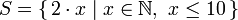
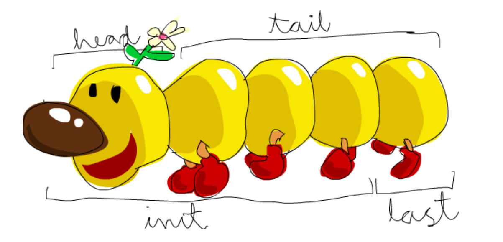

### 交互式运行环境
在命令行输入 `ghci`，即可进入交互式运行环境
#### 引入`*.hs`文件
在命令行内引入文件，可以使用该文件内定义的函数。假设文件名为 `func.hs`，那么引入的代码如下：
``` haskell
ghci> :l func.hs
```
### 运算符
在 Haskell 中可以使用符号表示的运算符（中缀），也可以将二目函数用中缀作为运算符
``` haskell
-- 整除
92 `div` 10
-- 取余
92 `mod` 10
```
### 数组
值得一提的设计是，在 Haskell 中，数组和字符串是完全相同的的设计 `'h','e','l','l','o'` 即 `"hello"`，可以使用类似的符号与操作。
#### 初始化
``` haskell
-- 定义名字
let num = [4, 8, 15, 23, 42]

-- range
ghci> [1..20]  
[1,2,3,4,5,6,7,8,9,10,11,12,13,14,15,16,17,18,19,20]  
ghci> ['a'..'z']  
"abcdefghijklmnopqrstuvwxyz"  
ghci> ['K'..'Z']  
"KLMNOPQRSTUVWXYZ"   

-- 设置range的step，只能是等差数列，可以是倒序
ghci> [2,4..20]  
[2,4,6,8,10,12,14,16,18,20]  
ghci> [3,6..20]  
[3,6,9,12,15,18]   

-- range 事实上提供无穷数字（Haskell is lazy!!）
-- 如果你想要24个13的乘积
ghci> [13,26..24*13]
-- 或
ghci> take 24 [13,26..]

-- 用 cycle 循环
ghci> take 10 (cycle [1,2,3])  
[1,2,3,1,2,3,1,2,3,1]  
ghci> take 12 (cycle "LOL ")  
"LOL LOL LOL "   

-- 重复数字用 repeat x 或 replicate n x
ghci> take 10 (repeat 5)  
[5,5,5,5,5,5,5,5,5,5]  
ghci> replicate 10 5

```
Haskell 以很数学的方式表达数组

``` haskell
-- 将上述映射用代码表示出来就是
ghci> [x*2 | x <- [1..10]]  
[2,4,6,8,10,12,14,16,18,20]  

-- 不等于13，15，19
ghci> [ x | x <- [10..20], x /= 13, x /= 15, x /= 19]  
[10,11,12,14,16,17,18,20]  

-- 嵌套
ghci> [ x*y | x <- [2,5,10], y <- [8,10,11]]  
[16,20,22,40,50,55,80,100,110]  

-- 遍历二维数组
ghci> let xxs = [[1,3,5,2,3,1,2,4,5],[1,2,3,4,5,6,7,8,9],[1,2,4,2,1,6,3,1,3,2,3,6]]  
ghci> [ [ x | x <- xs, even x ] | xs <- xxs]  
[[2,2,4],[2,4,6,8],[2,4,2,6,2,6]]
```
#### 数组取数
数组取数使用符号 `!!`，Haskell 的下标从0开始（与人性化的mma不一样呢
``` haskell
ghci> "Steve Buscemi" !! 6  
'B'  
ghci> [9.4,33.2,96.2,11.2,23.25] !! 1  
33.2  
```
`head` `tail` `last` `init` 之间的关系如下


`take` 获取从 0 位开始的数组
`drop` 得到剩下的数组
#### 数组判断
``` haskell
-- length 获取数组长度
ghci> length [5,4,3,2,1]  
5  

-- null 判断是否为空
ghci> null [1,2,3]  
False  
ghci> null []  
True  

-- elem x y 判断x是否为y中元素
ghci> 4 `elem` [3,4,5,6]  
True  
ghci> 10 `elem` [3,4,5,6]  
False  
```
#### 数组运算
``` haskell
-- maximun 得到最大值
-- minimun 得到最小值
ghci> minimum [8,4,2,1,5,6]  
1  
ghci> maximum [1,9,2,3,4]  
9   

-- sum 得到和
-- product 得到乘积
ghci> sum [5,2,1,6,3,2,5,7]  
31  
ghci> product [6,2,1,2]  
24  
ghci> product [1,2,5,6,7,9,2,0]  
0   

```

#### 添加元素
``` haskell
-- 在数组末添加元素
ghci> [1,2,3,4] ++ [9,10,11,12]  
[1,2,3,4,9,10,11,12]  
ghci> [1,2,3] ++ [4]
[1,2,3,4]

-- 在数组开头添加元素
ghci> 'A':" SMALL CAT"  
"A SMALL CAT"  
ghci> 5:[1,2,3,4,5]  
[5,1,2,3,4,5]  
-- 多个元素也类似
ghci> 2:3:4:[1,2]
[2,3,4,1,2]
```
#### 数组比较
前面提到数组和字符串在 Haskell 中有高度一致性，在比较两个数组时，你可以用 `>`、`<`、`>=`、`<=` 比较两个数组的字典序
``` haskell
ghci> [3,2,1] > [2,1,0]  
True  
ghci> [3,2,1] > [2,10,100]  
True  
ghci> [3,4,2] > [3,4]  
True  
ghci> [3,4,2] > [2,4]  
True  
ghci> [3,4,2] == [3,4,2]  
True  
```

### 元组
元组类似数组，但是元组是定长的。
比如可以有`[[1,2],[8,11,5],[4,5]]`；
但只能有`[(1,2),(8,11),(4,5)]`，只有等长的元组被认为是一类；也只有等长的数组可以比较大小
#### 元组取数
如果元组长度为 2 那么可以用 `fst`、`snd`取其第一个数和第二个数
``` haskell
ghci> fst (8,11)  
8  
ghci> fst ("Wow", False)  
"Wow"  

ghci> snd (8,11)  
11  
ghci> snd ("Wow", False)  
False  
```
一般用 `zip` 生成成对的元组
``` haskell
ghci> zip [1,2,3,4,5] [5,5,5,5,5]  
[(1,5),(2,5),(3,5),(4,5),(5,5)]  


ghci> zip [1..] ["apple", "orange", "cherry", "mango"]  
[(1,"apple"),(2,"orange"),(3,"cherry"),(4,"mango")]  


```
